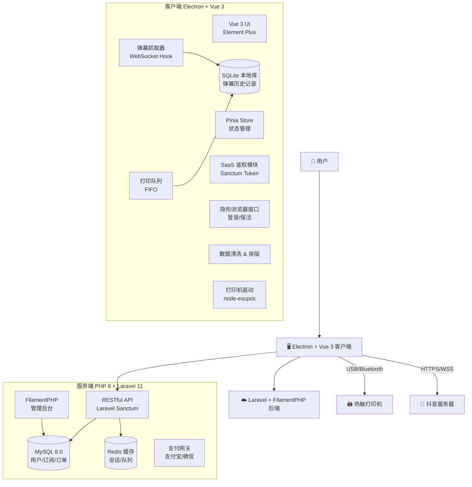

# 抖音弹幕打印 SaaS 系统技术文档

## 📋 项目概述

### 项目背景
将线上互动（弹幕）转化为线下实体（热敏纸打印），应用于无人直播、互动直播或线下门店引流等场景。这是一个具有商业潜力的 SaaS 项目，通过实时打印直播间弹幕，增强线上线下互动体验。

### 核心功能
- 🔐 抖音账号持久化登录
- 📡 实时抓取直播间弹幕数据
- 🖨️ 热敏打印机自动打印
- 💳 SaaS 订阅付费模式
- 🎯 智能过滤与队列管理
- 🎨 自定义排版设置

---

## 🛠️ 技术选型

### 1. 客户端技术栈

#### 选定方案：Electron + Vue 3 + SQLite

**技术栈组合：**
```
桌面框架: Electron ^28.0.0
前端框架: Vue 3.4+ (Composition API)
UI 组件库: Element Plus 2.5+
状态管理: Pinia 2.1+
路由管理: Vue Router 4.x
构建工具: Vite 5.x
类型检查: TypeScript 5.x
本地数据库: SQLite3 (better-sqlite3)
打印驱动: node-escpos
进程通信: Electron IPC
```

**选择理由：**

| 技术 | 优势说明 |
|------|---------|
| **Vue 3** | 响应式性能更好，Composition API 代码复用性强 |
| **SQLite** | 无需服务器，嵌入式数据库，完美适配离线场景 |
| **Element Plus** | 组件丰富，文档完善，与 Vue 3 深度集成 |
| **Pinia** | Vue 3 官方推荐状态管理，TypeScript 友好 |
| **Vite** | 极速冷启动，HMR 热更新体验极佳 |

### 2. 服务端技术栈

**选定方案：PHP 8+ + FilamentPHP + MySQL**

```
核心框架: Laravel 11.x
管理面板: FilamentPHP .x (最新版本)
数据库: MySQL 8.0+
缓存层: Redis 7.x
Web 服务器: Nginx + PHP-FPM
包管理器: Composer 2.x
API 认证: Laravel Sanctum
队列系统: Laravel Queue + Redis
支付接口: 支付宝 SDK / 微信支付 SDK
```

**FilamentPHP 优势：**

| 功能模块 | 说明 |
|---------|------|
| **Admin Panel** | 开箱即用的后台管理系统，无需自己开发 |
| **CRUD 生成器** | 自动生成用户/订单/订阅管理界面 |
| **表单构建器** | 声明式表单，支持复杂验证规则 |
| **数据表格** | 高性能表格，支持搜索/过滤/导出 |
| **权限管理** | 集成 Spatie Permission，角色权限开箱即用 |
| **仪表盘** | 可视化数据统计，Widget 组件丰富 |

### 3. 核心依赖库

#### 客户端 (package.json)

```json
{
  "name": "douyin-barrage-printer",
  "version": "1.0.0",
  "dependencies": {
    "vue": "^3.4.0",
    "vue-router": "^4.2.5",
    "pinia": "^2.1.7",
    "element-plus": "^2.5.0",
    "@element-plus/icons-vue": "^2.3.1",
    "axios": "^1.6.0",
    "better-sqlite3": "^9.2.0",
    "electron-store": "^8.1.0",
    "node-escpos": "^3.0.0",
    "escpos-usb": "^3.0.0",
    "protobufjs": "^7.2.5",
    "ws": "^8.14.0",
    "node-machine-id": "^1.1.12"
  },
  "devDependencies": {
    "electron": "^28.0.0",
    "electron-builder": "^24.9.1",
    "vite": "^5.0.0",
    "@vitejs/plugin-vue": "^5.0.0",
    "typescript": "^5.3.0",
    "vite-plugin-electron": "^0.28.0"
  }
}
```

#### 服务端 (composer.json)

```json
{
  "name": "douyin-saas/backend",
  "require": {
    "php": "^8.2",
    "laravel/framework": "^11.0",
    "filament/filament": "^3.2",
    "laravel/sanctum": "^4.0",
    "spatie/laravel-permission": "^6.3",
    "yansongda/pay": "^3.7",
    "predis/predis": "^2.2"
  },
  "require-dev": {
    "laravel/pint": "^1.13",
    "nunomaduro/collision": "^8.0",
    "pestphp/pest": "^2.0"
  }
}
```

---

## 🏗️ 系统架构设计

### 1. 架构模式

采用 **C/S (Client/Server) 架构**，重客户端，轻服务端。

- **服务端职责**: 用户管理、鉴权、订阅支付、版本控制
- **客户端职责**: 登录抖音、抓包解析、驱动打印机（核心业务逻辑）

### 2. 架构图



### 3. 数据流程图

```
用户操作 → Electron UI
    ↓
登录抖音 → Cookie 持久化
    ↓
进入直播间 → WebSocket 连接建立
    ↓
接收 Protobuf 数据流 → 反序列化解析
    ↓
弹幕过滤 → 入打印队列
    ↓
ESC/POS 指令生成 → 发送到打印机
    ↓
实时打印输出
```

---

## 🔑 核心技术实现

### 0. SQLite 本地数据库设计

#### 数据库结构

客户端使用 SQLite 存储弹幕历史、打印记录等数据，**不同步到服务器**，保护用户隐私。

**表结构设计：**

```sql
-- 弹幕记录表
CREATE TABLE barrages (
    id INTEGER PRIMARY KEY AUTOINCREMENT,
    room_id TEXT NOT NULL,                -- 直播间ID
    user_id TEXT NOT NULL,                -- 用户抖音ID
    nickname TEXT NOT NULL,               -- 用户昵称
    content TEXT NOT NULL,                -- 弹幕内容
    user_level INTEGER DEFAULT 0,         -- 用户等级
    avatar_url TEXT,                      -- 头像URL
    type TEXT DEFAULT 'text',             -- 类型: text/gift/like
    gift_name TEXT,                       -- 礼物名称（如果是礼物）
    gift_count INTEGER DEFAULT 0,         -- 礼物数量
    created_at INTEGER NOT NULL,          -- 时间戳（毫秒）
    is_printed INTEGER DEFAULT 0,         -- 是否已打印 0/1
    printed_at INTEGER                    -- 打印时间戳
);

-- 打印任务队列表
CREATE TABLE print_queue (
    id INTEGER PRIMARY KEY AUTOINCREMENT,
    barrage_id INTEGER NOT NULL,
    status TEXT DEFAULT 'pending',        -- pending/printing/success/failed
    retry_count INTEGER DEFAULT 0,
    error_message TEXT,
    created_at INTEGER NOT NULL,
    printed_at INTEGER,
    FOREIGN KEY (barrage_id) REFERENCES barrages(id)
);

-- 打印配置表
CREATE TABLE print_settings (
    id INTEGER PRIMARY KEY AUTOINCREMENT,
    setting_key TEXT UNIQUE NOT NULL,
    setting_value TEXT,
    updated_at INTEGER NOT NULL
);

-- 直播间会话表
CREATE TABLE live_sessions (
    id INTEGER PRIMARY KEY AUTOINCREMENT,
    room_id TEXT NOT NULL,
    room_title TEXT,
    anchor_name TEXT,
    started_at INTEGER NOT NULL,
    ended_at INTEGER,
    total_barrages INTEGER DEFAULT 0,
    total_printed INTEGER DEFAULT 0
);

-- 创建索引
CREATE INDEX idx_barrages_room_id ON barrages(room_id);
CREATE INDEX idx_barrages_created_at ON barrages(created_at);
CREATE INDEX idx_barrages_is_printed ON barrages(is_printed);
CREATE INDEX idx_print_queue_status ON print_queue(status);
```

#### SQLite 初始化代码

```typescript
// electron/database/sqlite.ts
import Database from 'better-sqlite3';
import { app } from 'electron';
import path from 'path';

export class SQLiteManager {
  private db: Database.Database;

  constructor() {
    const dbPath = path.join(app.getPath('userData'), 'douyin_barrage.db');
    this.db = new Database(dbPath);
    this.init();
  }

  private init() {
    // 开启 WAL 模式提升性能
    this.db.pragma('journal_mode = WAL');
    
    // 创建表结构
    this.db.exec(`
      CREATE TABLE IF NOT EXISTS barrages (
        id INTEGER PRIMARY KEY AUTOINCREMENT,
        room_id TEXT NOT NULL,
        user_id TEXT NOT NULL,
        nickname TEXT NOT NULL,
        content TEXT NOT NULL,
        user_level INTEGER DEFAULT 0,
        avatar_url TEXT,
        type TEXT DEFAULT 'text',
        gift_name TEXT,
        gift_count INTEGER DEFAULT 0,
        created_at INTEGER NOT NULL,
        is_printed INTEGER DEFAULT 0,
        printed_at INTEGER
      );

      CREATE TABLE IF NOT EXISTS print_queue (
        id INTEGER PRIMARY KEY AUTOINCREMENT,
        barrage_id INTEGER NOT NULL,
        status TEXT DEFAULT 'pending',
        retry_count INTEGER DEFAULT 0,
        error_message TEXT,
        created_at INTEGER NOT NULL,
        printed_at INTEGER,
        FOREIGN KEY (barrage_id) REFERENCES barrages(id)
      );

      CREATE TABLE IF NOT EXISTS print_settings (
        id INTEGER PRIMARY KEY AUTOINCREMENT,
        setting_key TEXT UNIQUE NOT NULL,
        setting_value TEXT,
        updated_at INTEGER NOT NULL
      );

      CREATE TABLE IF NOT EXISTS live_sessions (
        id INTEGER PRIMARY KEY AUTOINCREMENT,
        room_id TEXT NOT NULL,
        room_title TEXT,
        anchor_name TEXT,
        started_at INTEGER NOT NULL,
        ended_at INTEGER,
        total_barrages INTEGER DEFAULT 0,
        total_printed INTEGER DEFAULT 0
      );

      CREATE INDEX IF NOT EXISTS idx_barrages_room_id ON barrages(room_id);
      CREATE INDEX IF NOT EXISTS idx_barrages_created_at ON barrages(created_at);
      CREATE INDEX IF NOT EXISTS idx_barrages_is_printed ON barrages(is_printed);
      CREATE INDEX IF NOT EXISTS idx_print_queue_status ON print_queue(status);
    `);

    console.log('✅ SQLite 数据库初始化完成');
  }

  // 插入弹幕
  insertBarrage(barrage: any) {
    const stmt = this.db.prepare(`
      INSERT INTO barrages (
        room_id, user_id, nickname, content, user_level,
        avatar_url, type, gift_name, gift_count, created_at
      ) VALUES (?, ?, ?, ?, ?, ?, ?, ?, ?, ?)
    `);

    const result = stmt.run(
      barrage.roomId,
      barrage.userId,
      barrage.nickname,
      barrage.content,
      barrage.userLevel || 0,
      barrage.avatarUrl,
      barrage.type || 'text',
      barrage.giftName,
      barrage.giftCount || 0,
      Date.now()
    );

    return result.lastInsertRowid;
  }

  // 查询弹幕历史
  getBarrages(roomId: string, limit = 100) {
    const stmt = this.db.prepare(`
      SELECT * FROM barrages 
      WHERE room_id = ? 
      ORDER BY created_at DESC 
      LIMIT ?
    `);
    return stmt.all(roomId, limit);
  }

  // 添加到打印队列
  addToPrintQueue(barrageId: number) {
    const stmt = this.db.prepare(`
      INSERT INTO print_queue (barrage_id, created_at)
      VALUES (?, ?)
    `);
    return stmt.run(barrageId, Date.now());
  }

  // 标记为已打印
  markAsPrinted(barrageId: number) {
    const stmt = this.db.prepare(`
      UPDATE barrages 
      SET is_printed = 1, printed_at = ? 
      WHERE id = ?
    `);
    return stmt.run(Date.now(), barrageId);
  }

  // 获取统计数据
  getStatistics(roomId: string) {
    const stmt = this.db.prepare(`
      SELECT 
        COUNT(*) as total,
        SUM(is_printed) as printed,
        COUNT(DISTINCT user_id) as unique_users
      FROM barrages
      WHERE room_id = ?
    `);
    return stmt.get(roomId);
  }

  // 清理旧数据（保留最近7天）
  cleanOldData() {
    const sevenDaysAgo = Date.now() - 7 * 24 * 60 * 60 * 1000;
    const stmt = this.db.prepare(`
      DELETE FROM barrages WHERE created_at < ?
    `);
    return stmt.run(sevenDaysAgo);
  }

  close() {
    this.db.close();
  }
}

// 导出单例
export const sqliteManager = new SQLiteManager();
```

#### Vue 3 数据查询组件

```vue
<!-- src/components/BarrageHistory.vue -->
<template>
  <el-card class="barrage-history">
    <template #header>
      <div class="header">
        <span>弹幕历史记录</span>
        <el-button @click="refreshData" :icon="Refresh" circle />
      </div>
    </template>

    <el-table :data="barrages" height="500" v-loading="loading">
      <el-table-column prop="nickname" label="用户" width="120" />
      <el-table-column prop="content" label="内容" min-width="200" />
      <el-table-column prop="type" label="类型" width="80">
        <template #default="{ row }">
          <el-tag :type="row.type === 'gift' ? 'success' : 'info'">
            {{ row.type === 'gift' ? '礼物' : '弹幕' }}
          </el-tag>
        </template>
      </el-table-column>
      <el-table-column prop="created_at" label="时间" width="160">
        <template #default="{ row }">
          {{ formatTime(row.created_at) }}
        </template>
      </el-table-column>
      <el-table-column prop="is_printed" label="打印状态" width="100">
        <template #default="{ row }">
          <el-tag :type="row.is_printed ? 'success' : 'warning'">
            {{ row.is_printed ? '已打印' : '未打印' }}
          </el-tag>
        </template>
      </el-table-column>
    </el-table>

    <div class="statistics">
      <el-statistic title="总弹幕数" :value="stats.total" />
      <el-statistic title="已打印" :value="stats.printed" />
      <el-statistic title="独立用户" :value="stats.unique_users" />
    </div>
  </el-card>
</template>

<script setup lang="ts">
import { ref, onMounted } from 'vue';
import { ElMessage } from 'element-plus';
import { Refresh } from '@element-plus/icons-vue';
import { useBarrageStore } from '@/stores/barrage';

const barrageStore = useBarrageStore();
const barrages = ref([]);
const stats = ref({ total: 0, printed: 0, unique_users: 0 });
const loading = ref(false);

const refreshData = async () => {
  loading.value = true;
  try {
    // 通过 IPC 调用主进程查询 SQLite
    barrages.value = await window.electronAPI.getBarrages();
    stats.value = await window.electronAPI.getStatistics();
  } catch (error) {
    ElMessage.error('加载数据失败');
  } finally {
    loading.value = false;
  }
};

const formatTime = (timestamp: number) => {
  return new Date(timestamp).toLocaleString('zh-CN');
};

onMounted(() => {
  refreshData();
});
</script>

<style scoped>
.header {
  display: flex;
  justify-content: space-between;
  align-items: center;
}

.statistics {
  display: flex;
  gap: 40px;
  margin-top: 20px;
  padding-top: 20px;
  border-top: 1px solid var(--el-border-color);
}
</style>
```

---

### 1. 抖音账号持久化方案

#### 核心策略：Cookie 注入与 Session 复用

**⚠️ 关键原则**: 不破解登录 API，模拟真实用户行为

#### 实现步骤：

**Step 1: 首次登录**

```typescript
// main.ts - Electron 主进程
import { BrowserWindow, session } from 'electron';

async function createLoginWindow() {
  const loginWindow = new BrowserWindow({
    width: 800,
    height: 600,
    webPreferences: {
      nodeIntegration: false,
      contextIsolation: true
    }
  });

  // 加载抖音登录页
  await loginWindow.loadURL('https://www.douyin.com/');

  // 监听导航变化，检测登录成功
  loginWindow.webContents.on('did-navigate', async (event, url) => {
    if (url.includes('/user/')) {
      // 登录成功，提取 Cookie
      await saveCookies();
      loginWindow.close();
    }
  });
}
```

**Step 2: Cookie 提取与加密存储**

```typescript
import Store from 'electron-store';
import { encrypt, decrypt } from './crypto';

const store = new Store();

async function saveCookies() {
  const cookies = await session.defaultSession.cookies.get({
    domain: '.douyin.com'
  });

  // 加密存储（防止本地文件被直接读取）
  const encryptedCookies = encrypt(JSON.stringify(cookies));
  store.set('douyin_cookies', encryptedCookies);
  
  console.log('✅ Cookie 已安全保存');
}
```

**Step 3: Cookie 注入与保活**

```typescript
async function restoreCookies() {
  const encryptedCookies = store.get('douyin_cookies');
  if (!encryptedCookies) return false;

  const cookies = JSON.parse(decrypt(encryptedCookies));

  for (const cookie of cookies) {
    await session.defaultSession.cookies.set({
      url: 'https://www.douyin.com',
      name: cookie.name,
      value: cookie.value,
      domain: cookie.domain,
      path: cookie.path,
      secure: cookie.secure,
      httpOnly: cookie.httpOnly,
      expirationDate: cookie.expirationDate
    });
  }

  return true;
}

// 后台保活机制
setInterval(async () => {
  const hiddenWindow = new BrowserWindow({ show: false });
  await hiddenWindow.loadURL('https://www.douyin.com/');
  setTimeout(() => hiddenWindow.close(), 5000);
}, 30 * 60 * 1000); // 每 30 分钟刷新一次
```

---

### 2. 直播间弹幕抓取方案

#### 方案对比

| 方案 | 难度 | 稳定性 | 性能 | 推荐度 |
|-----|------|--------|------|--------|
| DOM 轮询 | ⭐ | ⭐⭐ | ⭐ | ❌ 不推荐 |
| WebSocket Hook | ⭐⭐⭐⭐ | ⭐⭐⭐⭐⭐ | ⭐⭐⭐⭐⭐ | ✅ 强烈推荐 |
| MITM 代理 | ⭐⭐⭐ | ⭐⭐⭐ | ⭐⭐⭐ | ⚠️ 备选方案 |

#### 推荐方案：WebSocket Hook 拦截

**原理说明:**
抖音直播间通过 WebSocket (WSS) 推送 Protobuf 格式的二进制数据流。通过劫持 `window.WebSocket` 对象，可以拦截所有弹幕消息。

**实现步骤:**

**Step 1: 注入预加载脚本**

```typescript
// preload.ts
import { contextBridge, ipcRenderer } from 'electron';

// 劫持 WebSocket 构造函数
const OriginalWebSocket = window.WebSocket;

window.WebSocket = function(url: string, protocols?: string | string[]) {
  const ws = new OriginalWebSocket(url, protocols);

  // 拦截接收消息
  const originalOnMessage = ws.onmessage;
  ws.onmessage = function(event) {
    // 将二进制数据发送给主进程
    if (event.data instanceof ArrayBuffer) {
      ipcRenderer.send('douyin-ws-message', event.data);
    }
    
    // 保持原有逻辑
    if (originalOnMessage) {
      originalOnMessage.call(ws, event);
    }
  };

  return ws;
} as any;

// 暴露安全的 API
contextBridge.exposeInMainWorld('electronAPI', {
  onBarrageReceived: (callback: Function) => {
    ipcRenderer.on('barrage-parsed', (_, data) => callback(data));
  }
});
```

**Step 2: Protobuf 解析**

```typescript
// main.ts - 主进程
import protobuf from 'protobufjs';
import { ipcMain } from 'electron';

// 加载抖音 Protobuf 定义（需从抖音前端逆向获取）
const root = await protobuf.load('./proto/douyin_live.proto');
const MessageType = root.lookupType('PushFrame');

ipcMain.on('douyin-ws-message', (event, arrayBuffer) => {
  try {
    // 解码二进制数据
    const buffer = Buffer.from(arrayBuffer);
    const message = MessageType.decode(buffer);
    const object = MessageType.toObject(message);

    // 解析弹幕类型
    if (object.method === 'WebcastChatMessage') {
      const barrage = {
        userId: object.payload.user.id,
        nickname: object.payload.user.nickname,
        content: object.payload.content,
        timestamp: Date.now()
      };

      // 发送到渲染进程
      event.reply('barrage-parsed', barrage);
      
      // 加入打印队列
      printQueue.enqueue(barrage);
    }
  } catch (error) {
    console.error('❌ Protobuf 解析失败:', error);
  }
});
```

**Step 3: 开源协议库推荐**

可以使用 GitHub 上已逆向的抖音协议库：
- [dy-live-proto](https://github.com/YunzhiYike/dy-live-proto)（仅供学习参考）

---

### 3. 打印功能实现

#### 核心挑战：高并发打印队列管理

直播间弹幕可能瞬间数百条，必须使用 **FIFO 队列 + 限流策略**。

#### 技术实现

**Step 1: 打印队列设计**

```typescript
// printQueue.ts
import Queue from 'queue';

class PrintQueue {
  private queue: Queue;
  private isProcessing: boolean = false;

  constructor(private printer: EscposPrinter) {
    this.queue = new Queue({
      concurrency: 1, // 串行打印
      autostart: true
    });
  }

  enqueue(barrage: Barrage) {
    // 应用过滤规则
    if (!this.shouldPrint(barrage)) {
      return;
    }

    this.queue.push(async () => {
      await this.print(barrage);
    });
  }

  private shouldPrint(barrage: Barrage): boolean {
    const filters = store.get('filters');

    // 关键词过滤
    if (filters.keywords && filters.keywords.length > 0) {
      const hasKeyword = filters.keywords.some(kw => 
        barrage.content.includes(kw)
      );
      if (!hasKeyword) return false;
    }

    // 用户等级过滤
    if (filters.minLevel && barrage.userLevel < filters.minLevel) {
      return false;
    }

    // 只打印送礼
    if (filters.giftOnly && barrage.type !== 'gift') {
      return false;
    }

    return true;
  }

  private async print(barrage: Barrage) {
    try {
      await this.printer.printText(`【${barrage.nickname}】${barrage.content}\n`);
      await this.printer.cut();
      console.log(`✅ 已打印: ${barrage.content}`);
    } catch (error) {
      console.error('❌ 打印失败:', error);
    }
  }
}
```

**Step 2: ESC/POS 打印驱动**

```typescript
// printer.ts
import escpos from 'escpos';
import USB from 'escpos-usb';

export class EscposPrinter {
  private device: USB;
  private printer: escpos.Printer;

  async connect() {
    // 自动检测 USB 打印机
    this.device = new USB();
    this.printer = new escpos.Printer(this.device);

    await this.device.open();
    console.log('✅ 打印机已连接');
  }

  async printText(text: string) {
    return new Promise((resolve, reject) => {
      this.printer
        .font('a')
        .align('lt')
        .style('normal')
        .size(1, 1)
        .text(text)
        .feed(1)
        .flush(() => resolve(true), (error) => reject(error));
    });
  }

  async cut() {
    return new Promise((resolve) => {
      this.printer.cut().flush(() => resolve(true));
    });
  }

  async printQRCode(url: string) {
    return new Promise((resolve) => {
      this.printer
        .qrcode(url, { type: 'qrcode', size: 6 })
        .feed(2)
        .flush(() => resolve(true));
    });
  }
}
```

**Step 3: 高级功能 - 自定义排版**

```typescript
interface PrintTemplate {
  header: string;      // 头部 Logo/标题
  fontSize: number;    // 字体大小
  alignment: 'left' | 'center' | 'right';
  showAvatar: boolean; // 是否打印用户头像
  showTime: boolean;   // 是否显示时间戳
}

async function printWithTemplate(barrage: Barrage, template: PrintTemplate) {
  // 打印头部
  if (template.header) {
    await printer.printText(template.header);
  }

  // 打印头像（转换为点阵图）
  if (template.showAvatar && barrage.avatarUrl) {
    const image = await downloadImage(barrage.avatarUrl);
    await printer.printImage(image);
  }

  // 打印主体内容
  printer
    .size(template.fontSize, template.fontSize)
    .align(template.alignment)
    .text(`${barrage.nickname}: ${barrage.content}\n`);

  // 打印时间戳
  if (template.showTime) {
    const time = new Date().toLocaleString('zh-CN');
    await printer.printText(`时间: ${time}\n`);
  }

  await printer.cut();
}
```

---

## 🔒 SaaS 架构与商业逻辑

### 1. 用户鉴权体系

#### 流程图

```
用户注册 → 邮箱验证 → 登录 → JWT Token 签发
    ↓
客户端存储 Token → 每次请求携带
    ↓
服务端验证 → 检查订阅状态 → 允许/拒绝
    ↓
心跳检测 → 防多开 → 机器码绑定
```

#### 实现示例

**客户端登录 (Vue 3 + Pinia)**

```typescript
// src/stores/auth.ts
import { defineStore } from 'pinia';
import { ref } from 'vue';
import axios from 'axios';

export const useAuthStore = defineStore('auth', () => {
  const token = ref<string | null>(localStorage.getItem('auth_token'));
  const user = ref<any>(null);
  const isAuthenticated = ref(false);

  // 配置 axios 拦截器
  axios.interceptors.request.use((config) => {
    if (token.value) {
      config.headers.Authorization = `Bearer ${token.value}`;
    }
    return config;
  });

  const login = async (email: string, password: string) => {
    try {
      const response = await axios.post('https://api.yoursaas.com/api/auth/login', {
        email,
        password
      });

      token.value = response.data.token;
      user.value = response.data.user;
      isAuthenticated.value = true;

      // 持久化存储
      localStorage.setItem('auth_token', response.data.token);
      localStorage.setItem('user_info', JSON.stringify(response.data.user));

      return { success: true };
    } catch (error: any) {
      return { 
        success: false, 
        message: error.response?.data?.message || '登录失败' 
      };
    }
  };

  const logout = () => {
    token.value = null;
    user.value = null;
    isAuthenticated.value = false;
    localStorage.removeItem('auth_token');
    localStorage.removeItem('user_info');
  };

  const checkSubscription = async () => {
    try {
      const response = await axios.get('/api/subscription/check');
      return response.data.active;
    } catch (error) {
      return false;
    }
  };

  return {
    token,
    user,
    isAuthenticated,
    login,
    logout,
    checkSubscription
  };
});
```

```vue
<!-- src/views/Login.vue -->
<template>
  <el-card class="login-card">
    <h2>登录抖音弹幕打印系统</h2>
    <el-form :model="form" :rules="rules" ref="formRef">
      <el-form-item prop="email">
        <el-input 
          v-model="form.email" 
          placeholder="邮箱地址" 
          prefix-icon="User"
        />
      </el-form-item>
      <el-form-item prop="password">
        <el-input 
          v-model="form.password" 
          type="password" 
          placeholder="密码"
          prefix-icon="Lock"
        />
      </el-form-item>
      <el-button 
        type="primary" 
        @click="handleLogin" 
        :loading="loading"
        style="width: 100%"
      >
        登录
      </el-button>
    </el-form>
  </el-card>
</template>

<script setup lang="ts">
import { ref, reactive } from 'vue';
import { useRouter } from 'vue-router';
import { ElMessage } from 'element-plus';
import { useAuthStore } from '@/stores/auth';

const router = useRouter();
const authStore = useAuthStore();
const formRef = ref();
const loading = ref(false);

const form = reactive({
  email: '',
  password: ''
});

const rules = {
  email: [
    { required: true, message: '请输入邮箱', trigger: 'blur' },
    { type: 'email', message: '邮箱格式不正确', trigger: 'blur' }
  ],
  password: [
    { required: true, message: '请输入密码', trigger: 'blur' },
    { min: 6, message: '密码至少6位', trigger: 'blur' }
  ]
};

const handleLogin = async () => {
  await formRef.value.validate(async (valid: boolean) => {
    if (!valid) return;

    loading.value = true;
    const result = await authStore.login(form.email, form.password);
    loading.value = false;

    if (result.success) {
      ElMessage.success('登录成功');
      router.push('/dashboard');
      
      // 启动心跳检测
      window.electronAPI.startHeartbeat();
    } else {
      ElMessage.error(result.message);
    }
  });
};
</script>
```

**服务端 API (Laravel + Sanctum)**

```php
<?php
// app/Http/Controllers/Api/AuthController.php

namespace App\Http\Controllers\Api;

use App\Http\Controllers\Controller;
use App\Models\User;
use Illuminate\Http\Request;
use Illuminate\Support\Facades\Hash;
use Illuminate\Validation\ValidationException;

class AuthController extends Controller
{
    /**
     * 用户登录
     */
    public function login(Request $request)
    {
        $request->validate([
            'email' => 'required|email',
            'password' => 'required',
        ]);

        $user = User::where('email', $request->email)->first();

        if (!$user || !Hash::check($request->password, $user->password)) {
            throw ValidationException::withMessages([
                'email' => ['邮箱或密码错误'],
            ]);
        }

        // 检查订阅状态
        if ($user->subscription_expiry < now()) {
            return response()->json([
                'message' => '订阅已过期，请续费后使用',
                'code' => 'SUBSCRIPTION_EXPIRED'
            ], 403);
        }

        // 创建 Token (设置过期时间为30天)
        $token = $user->createToken('electron-client', ['*'], now()->addDays(30))->plainTextToken;

        return response()->json([
            'token' => $token,
            'user' => [
                'id' => $user->id,
                'name' => $user->name,
                'email' => $user->email,
                'plan' => $user->plan,
                'subscription_expiry' => $user->subscription_expiry,
            ]
        ]);
    }

    /**
     * 退出登录
     */
    public function logout(Request $request)
    {
        $request->user()->currentAccessToken()->delete();

        return response()->json([
            'message' => '退出成功'
        ]);
    }

    /**
     * 获取当前用户信息
     */
    public function me(Request $request)
    {
        return response()->json([
            'user' => $request->user()
        ]);
    }
}
```

**Laravel 路由配置**

```php
<?php
// routes/api.php

use App\Http\Controllers\Api\AuthController;
use App\Http\Controllers\Api\SubscriptionController;
use App\Http\Controllers\Api\HeartbeatController;
use Illuminate\Support\Facades\Route;

// 公开路由
Route::post('/auth/login', [AuthController::class, 'login']);
Route::post('/auth/register', [AuthController::class, 'register']);

// 需要认证的路由
Route::middleware('auth:sanctum')->group(function () {
    Route::post('/auth/logout', [AuthController::class, 'logout']);
    Route::get('/auth/me', [AuthController::class, 'me']);
    
    // 订阅管理
    Route::get('/subscription/check', [SubscriptionController::class, 'check']);
    Route::post('/subscription/upgrade', [SubscriptionController::class, 'upgrade']);
    
    // 心跳检测
    Route::post('/heartbeat', [HeartbeatController::class, 'handle']);
});
```

**认证中间件（已内置在 Sanctum 中）**

Laravel Sanctum 已经提供了完整的 Token 认证机制，无需额外编写中间件。只需在路由中使用 `auth:sanctum` 即可。

如需自定义检查订阅状态，可以创建中间件：

```php
<?php
// app/Http/Middleware/CheckSubscription.php

namespace App\Http\Middleware;

use Closure;
use Illuminate\Http\Request;

class CheckSubscription
{
    public function handle(Request $request, Closure $next)
    {
        $user = $request->user();

        if (!$user) {
            return response()->json(['message' => '未授权'], 401);
        }

        // 检查订阅是否过期
        if ($user->subscription_expiry < now()) {
            return response()->json([
                'message' => '订阅已过期',
                'code' => 'SUBSCRIPTION_EXPIRED',
                'expiry_date' => $user->subscription_expiry->format('Y-m-d H:i:s')
            ], 403);
        }

        return $next($request);
    }
}
```

注册中间件：

```php
<?php
// app/Http/Kernel.php

protected $middlewareAliases = [
    // ... 其他中间件
    'subscription' => \App\Http\Middleware\CheckSubscription::class,
];
```

使用：

```php
Route::middleware(['auth:sanctum', 'subscription'])->group(function () {
    // 需要有效订阅才能访问的路由
});
```

### 2. 防多开机制

```typescript
// main.ts - 心跳检测
import { machineIdSync } from 'node-machine-id';

const MACHINE_ID = machineIdSync();

setInterval(async () => {
  const response = await fetch('https://api.yoursaas.com/heartbeat', {
    method: 'POST',
    headers: {
      'Authorization': `Bearer ${store.get('auth_token')}`,
      'Content-Type': 'application/json'
    },
    body: JSON.stringify({
      machineId: MACHINE_ID,
      timestamp: Date.now()
    })
  });

  const { allowed, message } = await response.json();

  if (!allowed) {
    // 检测到多开，强制退出
    dialog.showErrorBox('账号异常', message);
    app.quit();
  }
}, 60 * 1000); // 每分钟一次
```

**服务端心跳处理 (Laravel + Redis)**

```php
<?php
// app/Http/Controllers/Api/HeartbeatController.php

namespace App\Http\Controllers\Api;

use App\Http\Controllers\Controller;
use Illuminate\Http\Request;
use Illuminate\Support\Facades\Redis;
use Illuminate\Support\Facades\Log;

class HeartbeatController extends Controller
{
    /**
     * 处理客户端心跳请求
     */
    public function handle(Request $request)
    {
        $request->validate([
            'machine_id' => 'required|string',
        ]);

        $user = $request->user();
        $machineId = $request->input('machine_id');
        $sessionKey = "session:user:{$user->id}";

        // 获取当前活跃的机器ID
        $activeSession = Redis::get($sessionKey);

        // 检测多开
        if ($activeSession && $activeSession !== $machineId) {
            Log::warning("检测到用户 {$user->id} 多设备登录", [
                'current_machine' => $activeSession,
                'new_machine' => $machineId
            ]);

            return response()->json([
                'allowed' => false,
                'message' => '检测到账号在其他设备登录，当前会话已失效',
                'code' => 'MULTI_LOGIN_DETECTED'
            ], 403);
        }

        // 更新会话（5 分钟过期）
        Redis::setex($sessionKey, 300, $machineId);

        // 记录最后活跃时间
        $user->update([
            'last_active_at' => now()
        ]);

        return response()->json([
            'allowed' => true,
            'user' => [
                'id' => $user->id,
                'plan' => $user->plan,
                'subscription_expiry' => $user->subscription_expiry,
            ]
        ]);
    }

    /**
     * 强制踢出其他设备
     */
    public function kickOtherDevices(Request $request)
    {
        $request->validate([
            'machine_id' => 'required|string',
        ]);

        $user = $request->user();
        $machineId = $request->input('machine_id');
        $sessionKey = "session:user:{$user->id}";

        // 强制设置当前设备为活跃设备
        Redis::setex($sessionKey, 300, $machineId);

        return response()->json([
            'message' => '已踢出其他设备',
            'allowed' => true
        ]);
    }
}
```

**数据库迁移**

```php
<?php
// database/migrations/2024_01_01_000001_add_last_active_to_users_table.php

use Illuminate\Database\Migrations\Migration;
use Illuminate\Database\Schema\Blueprint;
use Illuminate\Support\Facades\Schema;

return new class extends Migration
{
    public function up(): void
    {
        Schema::table('users', function (Blueprint $table) {
            $table->timestamp('last_active_at')->nullable()->after('subscription_expiry');
            $table->string('last_machine_id')->nullable()->after('last_active_at');
        });
    }

    public function down(): void
    {
        Schema::table('users', function (Blueprint $table) {
            $table->dropColumn(['last_active_at', 'last_machine_id']);
        });
    }
};
```

### 3. FilamentPHP 后台管理

#### 用户管理资源

```php
<?php
// app/Filament/Resources/UserResource.php

namespace App\Filament\Resources;

use App\Filament\Resources\UserResource\Pages;
use App\Models\User;
use Filament\Forms;
use Filament\Forms\Form;
use Filament\Resources\Resource;
use Filament\Tables;
use Filament\Tables\Table;
use Illuminate\Support\Facades\Hash;

class UserResource extends Resource
{
    protected static ?string $model = User::class;
    protected static ?string $navigationIcon = 'heroicon-o-users';
    protected static ?string $navigationLabel = '用户管理';
    protected static ?string $modelLabel = '用户';

    public static function form(Form $form): Form
    {
        return $form
            ->schema([
                Forms\Components\Section::make('基本信息')
                    ->schema([
                        Forms\Components\TextInput::make('name')
                            ->label('用户名')
                            ->required()
                            ->maxLength(255),
                        
                        Forms\Components\TextInput::make('email')
                            ->label('邮箱')
                            ->email()
                            ->required()
                            ->unique(ignoreRecord: true)
                            ->maxLength(255),
                        
                        Forms\Components\TextInput::make('password')
                            ->label('密码')
                            ->password()
                            ->dehydrateStateUsing(fn ($state) => Hash::make($state))
                            ->dehydrated(fn ($state) => filled($state))
                            ->required(fn (string $context): bool => $context === 'create'),
                    ]),
                
                Forms\Components\Section::make('订阅信息')
                    ->schema([
                        Forms\Components\Select::make('plan')
                            ->label('套餐类型')
                            ->options([
                                'free' => '免费版',
                                'basic' => '基础版',
                                'pro' => '专业版',
                                'enterprise' => '企业版',
                            ])
                            ->required()
                            ->default('free'),
                        
                        Forms\Components\DateTimePicker::make('subscription_expiry')
                            ->label('订阅到期时间')
                            ->required()
                            ->default(now()->addMonth()),
                        
                        Forms\Components\Toggle::make('is_active')
                            ->label('账号启用')
                            ->default(true),
                    ]),
            ]);
    }

    public static function table(Table $table): Table
    {
        return $table
            ->columns([
                Tables\Columns\TextColumn::make('id')
                    ->label('ID')
                    ->sortable(),
                
                Tables\Columns\TextColumn::make('name')
                    ->label('用户名')
                    ->searchable()
                    ->sortable(),
                
                Tables\Columns\TextColumn::make('email')
                    ->label('邮箱')
                    ->searchable()
                    ->copyable(),
                
                Tables\Columns\BadgeColumn::make('plan')
                    ->label('套餐')
                    ->colors([
                        'secondary' => 'free',
                        'success' => 'basic',
                        'warning' => 'pro',
                        'danger' => 'enterprise',
                    ])
                    ->formatStateUsing(fn (string $state): string => match ($state) {
                        'free' => '免费版',
                        'basic' => '基础版',
                        'pro' => '专业版',
                        'enterprise' => '企业版',
                        default => $state,
                    }),
                
                Tables\Columns\TextColumn::make('subscription_expiry')
                    ->label('到期时间')
                    ->dateTime('Y-m-d H:i')
                    ->sortable()
                    ->color(fn ($record) => $record->subscription_expiry < now() ? 'danger' : 'success'),
                
                Tables\Columns\IconColumn::make('is_active')
                    ->label('状态')
                    ->boolean(),
                
                Tables\Columns\TextColumn::make('last_active_at')
                    ->label('最后活跃')
                    ->dateTime('Y-m-d H:i')
                    ->since()
                    ->sortable(),
                
                Tables\Columns\TextColumn::make('created_at')
                    ->label('注册时间')
                    ->dateTime('Y-m-d H:i')
                    ->sortable()
                    ->toggleable(isToggledHiddenByDefault: true),
            ])
            ->filters([
                Tables\Filters\SelectFilter::make('plan')
                    ->label('套餐类型')
                    ->options([
                        'free' => '免费版',
                        'basic' => '基础版',
                        'pro' => '专业版',
                        'enterprise' => '企业版',
                    ]),
                
                Tables\Filters\Filter::make('subscription_expired')
                    ->label('订阅已过期')
                    ->query(fn ($query) => $query->where('subscription_expiry', '<', now())),
            ])
            ->actions([
                Tables\Actions\EditAction::make(),
                Tables\Actions\Action::make('extend_subscription')
                    ->label('延长订阅')
                    ->icon('heroicon-o-clock')
                    ->form([
                        Forms\Components\Select::make('duration')
                            ->label('延长时长')
                            ->options([
                                '1_month' => '1个月',
                                '3_months' => '3个月',
                                '6_months' => '6个月',
                                '1_year' => '1年',
                            ])
                            ->required(),
                    ])
                    ->action(function (User $record, array $data) {
                        $duration = match ($data['duration']) {
                            '1_month' => 1,
                            '3_months' => 3,
                            '6_months' => 6,
                            '1_year' => 12,
                        };
                        
                        $currentExpiry = $record->subscription_expiry > now() 
                            ? $record->subscription_expiry 
                            : now();
                        
                        $record->update([
                            'subscription_expiry' => $currentExpiry->addMonths($duration)
                        ]);
                    })
                    ->successNotificationTitle('订阅已延长'),
            ])
            ->bulkActions([
                Tables\Actions\BulkActionGroup::make([
                    Tables\Actions\DeleteBulkAction::make(),
                ]),
            ]);
    }

    public static function getPages(): array
    {
        return [
            'index' => Pages\ListUsers::route('/'),
            'create' => Pages\CreateUser::route('/create'),
            'edit' => Pages\EditUser::route('/{record}/edit'),
        ];
    }
}
```

#### 订单管理资源

```php
<?php
// app/Filament/Resources/OrderResource.php

namespace App\Filament\Resources;

use App\Filament\Resources\OrderResource\Pages;
use App\Models\Order;
use Filament\Forms;
use Filament\Forms\Form;
use Filament\Resources\Resource;
use Filament\Tables;
use Filament\Tables\Table;

class OrderResource extends Resource
{
    protected static ?string $model = Order::class;
    protected static ?string $navigationIcon = 'heroicon-o-shopping-cart';
    protected static ?string $navigationLabel = '订单管理';
    protected static ?string $modelLabel = '订单';

    public static function form(Form $form): Form
    {
        return $form
            ->schema([
                Forms\Components\Select::make('user_id')
                    ->label('用户')
                    ->relationship('user', 'name')
                    ->searchable()
                    ->required(),
                
                Forms\Components\TextInput::make('order_no')
                    ->label('订单号')
                    ->default(fn () => 'ORD' . date('YmdHis') . rand(1000, 9999))
                    ->required()
                    ->unique(ignoreRecord: true),
                
                Forms\Components\Select::make('plan')
                    ->label('套餐')
                    ->options([
                        'basic' => '基础版 - ¥99/月',
                        'pro' => '专业版 - ¥299/月',
                        'enterprise' => '企业版 - 定制',
                    ])
                    ->required(),
                
                Forms\Components\TextInput::make('amount')
                    ->label('金额')
                    ->numeric()
                    ->prefix('¥')
                    ->required(),
                
                Forms\Components\Select::make('status')
                    ->label('状态')
                    ->options([
                        'pending' => '待支付',
                        'paid' => '已支付',
                        'cancelled' => '已取消',
                        'refunded' => '已退款',
                    ])
                    ->required()
                    ->default('pending'),
                
                Forms\Components\Select::make('payment_method')
                    ->label('支付方式')
                    ->options([
                        'alipay' => '支付宝',
                        'wechat' => '微信支付',
                    ]),
                
                Forms\Components\Textarea::make('remark')
                    ->label('备注')
                    ->columnSpanFull(),
            ]);
    }

    public static function table(Table $table): Table
    {
        return $table
            ->columns([
                Tables\Columns\TextColumn::make('order_no')
                    ->label('订单号')
                    ->searchable()
                    ->copyable(),
                
                Tables\Columns\TextColumn::make('user.name')
                    ->label('用户')
                    ->searchable(),
                
                Tables\Columns\BadgeColumn::make('plan')
                    ->label('套餐')
                    ->colors([
                        'success' => 'basic',
                        'warning' => 'pro',
                        'danger' => 'enterprise',
                    ]),
                
                Tables\Columns\TextColumn::make('amount')
                    ->label('金额')
                    ->money('CNY')
                    ->sortable(),
                
                Tables\Columns\BadgeColumn::make('status')
                    ->label('状态')
                    ->colors([
                        'warning' => 'pending',
                        'success' => 'paid',
                        'danger' => 'cancelled',
                        'secondary' => 'refunded',
                    ])
                    ->formatStateUsing(fn (string $state): string => match ($state) {
                        'pending' => '待支付',
                        'paid' => '已支付',
                        'cancelled' => '已取消',
                        'refunded' => '已退款',
                        default => $state,
                    }),
                
                Tables\Columns\TextColumn::make('payment_method')
                    ->label('支付方式')
                    ->formatStateUsing(fn (?string $state): string => match ($state) {
                        'alipay' => '支付宝',
                        'wechat' => '微信支付',
                        default => '-',
                    }),
                
                Tables\Columns\TextColumn::make('created_at')
                    ->label('创建时间')
                    ->dateTime('Y-m-d H:i')
                    ->sortable(),
            ])
            ->defaultSort('created_at', 'desc')
            ->filters([
                Tables\Filters\SelectFilter::make('status')
                    ->label('状态')
                    ->options([
                        'pending' => '待支付',
                        'paid' => '已支付',
                        'cancelled' => '已取消',
                        'refunded' => '已退款',
                    ]),
            ])
            ->actions([
                Tables\Actions\EditAction::make(),
                Tables\Actions\ViewAction::make(),
            ]);
    }

    public static function getPages(): array
    {
        return [
            'index' => Pages\ListOrders::route('/'),
            'create' => Pages\CreateOrder::route('/create'),
            'edit' => Pages\EditOrder::route('/{record}/edit'),
            'view' => Pages\ViewOrder::route('/{record}'),
        ];
    }
}
```

#### 仪表盘 Widget

```php
<?php
// app/Filament/Widgets/StatsOverview.php

namespace App\Filament\Widgets;

use App\Models\User;
use App\Models\Order;
use Filament\Widgets\StatsOverviewWidget as BaseWidget;
use Filament\Widgets\StatsOverviewWidget\Stat;

class StatsOverview extends BaseWidget
{
    protected function getStats(): array
    {
        return [
            Stat::make('总用户数', User::count())
                ->description('较上月增长 ' . $this->getUserGrowth() . '%')
                ->descriptionIcon('heroicon-m-arrow-trending-up')
                ->color('success')
                ->chart($this->getUserChart()),
            
            Stat::make('付费用户', User::where('plan', '!=', 'free')->count())
                ->description('转化率 ' . $this->getConversionRate() . '%')
                ->descriptionIcon('heroicon-m-user-group')
                ->color('warning'),
            
            Stat::make('本月收入', '¥' . number_format(Order::where('status', 'paid')
                ->whereMonth('created_at', now()->month)
                ->sum('amount'), 2))
                ->description('较上月增长 ' . $this->getRevenueGrowth() . '%')
                ->descriptionIcon('heroicon-m-currency-dollar')
                ->color('success')
                ->chart($this->getRevenueChart()),
            
            Stat::make('活跃用户', User::where('last_active_at', '>=', now()->subDays(7))->count())
                ->description('最近7天')
                ->descriptionIcon('heroicon-m-chart-bar')
                ->color('info'),
        ];
    }

    private function getUserGrowth(): string
    {
        $currentMonth = User::whereMonth('created_at', now()->month)->count();
        $lastMonth = User::whereMonth('created_at', now()->subMonth()->month)->count();
        
        if ($lastMonth == 0) return '0';
        return number_format((($currentMonth - $lastMonth) / $lastMonth) * 100, 1);
    }

    private function getConversionRate(): string
    {
        $total = User::count();
        $paid = User::where('plan', '!=', 'free')->count();
        
        if ($total == 0) return '0';
        return number_format(($paid / $total) * 100, 1);
    }

    private function getRevenueGrowth(): string
    {
        $currentMonth = Order::where('status', 'paid')
            ->whereMonth('created_at', now()->month)
            ->sum('amount');
        
        $lastMonth = Order::where('status', 'paid')
            ->whereMonth('created_at', now()->subMonth()->month)
            ->sum('amount');
        
        if ($lastMonth == 0) return '0';
        return number_format((($currentMonth - $lastMonth) / $lastMonth) * 100, 1);
    }

    private function getUserChart(): array
    {
        return User::selectRaw('DATE(created_at) as date, COUNT(*) as count')
            ->where('created_at', '>=', now()->subDays(7))
            ->groupBy('date')
            ->pluck('count')
            ->toArray();
    }

    private function getRevenueChart(): array
    {
        return Order::selectRaw('DATE(created_at) as date, SUM(amount) as total')
            ->where('status', 'paid')
            ->where('created_at', '>=', now()->subDays(7))
            ->groupBy('date')
            ->pluck('total')
            ->toArray();
    }
}
```

---

### 4. 订阅套餐设计

| 套餐类型 | 价格 | 功能限制 |
|---------|------|---------|
| 免费版 | ¥0 | 每日 100 条打印 |
| 基础版 | ¥99/月 | 无限打印 + 基础过滤 |
| 专业版 | ¥299/月 | 高级过滤 + 自定义排版 + API 接口 |
| 企业版 | 定制 | 多账号管理 + 技术支持 |

**订阅检查 API**

**服务端 (Laravel)**

```php
<?php
// app/Http/Controllers/Api/SubscriptionController.php

namespace App\Http\Controllers\Api;

use App\Http\Controllers\Controller;
use Illuminate\Http\Request;

class SubscriptionController extends Controller
{
    /**
     * 检查订阅状态
     */
    public function check(Request $request)
    {
        $user = $request->user();
        $isActive = $user->subscription_expiry > now();

        return response()->json([
            'active' => $isActive,
            'plan' => $user->plan,
            'expiry_date' => $user->subscription_expiry->format('Y-m-d H:i:s'),
            'days_remaining' => $isActive ? now()->diffInDays($user->subscription_expiry) : 0,
            'features' => $this->getPlanFeatures($user->plan),
        ]);
    }

    /**
     * 升级套餐
     */
    public function upgrade(Request $request)
    {
        $request->validate([
            'plan' => 'required|in:basic,pro,enterprise',
            'duration' => 'required|in:monthly,quarterly,yearly',
        ]);

        $plan = $request->input('plan');
        $duration = $request->input('duration');
        
        // 计算金额
        $amount = $this->calculateAmount($plan, $duration);

        // 创建订单
        $order = $request->user()->orders()->create([
            'order_no' => 'ORD' . date('YmdHis') . rand(1000, 9999),
            'plan' => $plan,
            'duration' => $duration,
            'amount' => $amount,
            'status' => 'pending',
        ]);

        // 返回支付信息
        return response()->json([
            'order_id' => $order->id,
            'order_no' => $order->order_no,
            'amount' => $amount,
            'payment_url' => route('payment.create', ['order' => $order->id]),
        ]);
    }

    /**
     * 获取套餐功能
     */
    private function getPlanFeatures(string $plan): array
    {
        return match ($plan) {
            'free' => [
                'daily_print_limit' => 100,
                'filters' => false,
                'custom_template' => false,
                'api_access' => false,
            ],
            'basic' => [
                'daily_print_limit' => -1, // 无限制
                'filters' => true,
                'custom_template' => false,
                'api_access' => false,
            ],
            'pro' => [
                'daily_print_limit' => -1,
                'filters' => true,
                'custom_template' => true,
                'api_access' => true,
            ],
            'enterprise' => [
                'daily_print_limit' => -1,
                'filters' => true,
                'custom_template' => true,
                'api_access' => true,
                'multi_account' => true,
                'priority_support' => true,
            ],
            default => [],
        };
    }

    /**
     * 计算订单金额
     */
    private function calculateAmount(string $plan, string $duration): float
    {
        $prices = [
            'basic' => [
                'monthly' => 99,
                'quarterly' => 267,  // 10% off
                'yearly' => 950,     // 20% off
            ],
            'pro' => [
                'monthly' => 299,
                'quarterly' => 807,
                'yearly' => 2870,
            ],
            'enterprise' => [
                'monthly' => 999,
                'quarterly' => 2697,
                'yearly' => 9590,
            ],
        ];

        return $prices[$plan][$duration] ?? 0;
    }
}
```

**客户端 (Vue 3 + TypeScript)**

```typescript
// src/composables/useSubscription.ts
import { ref } from 'vue';
import axios from 'axios';
import { ElMessageBox, ElMessage } from 'element-plus';

export interface SubscriptionInfo {
  active: boolean;
  plan: string;
  expiry_date: string;
  days_remaining: number;
  features: {
    daily_print_limit: number;
    filters: boolean;
    custom_template: boolean;
    api_access: boolean;
  };
}

export function useSubscription() {
  const subscriptionInfo = ref<SubscriptionInfo | null>(null);
  const loading = ref(false);

  /**
   * 检查订阅权限
   */
  const checkPermission = async (): Promise<boolean> => {
    loading.value = true;
    
    try {
      const response = await axios.get<SubscriptionInfo>('/api/subscription/check');
      subscriptionInfo.value = response.data;

      if (!response.data.active) {
        const result = await ElMessageBox.confirm(
          `您的 ${getPlanName(response.data.plan)} 套餐已于 ${response.data.expiry_date} 过期，请续费后继续使用。`,
          '订阅已过期',
          {
            confirmButtonText: '立即续费',
            cancelButtonText: '稍后提醒',
            type: 'warning',
          }
        );

        if (result === 'confirm') {
          // 打开续费页面
          window.electronAPI.openExternal('https://yoursaas.com/pricing');
        }

        return false;
      }

      // 剩余天数少于7天时提醒
      if (response.data.days_remaining <= 7 && response.data.days_remaining > 0) {
        ElMessage.warning(`您的订阅还有 ${response.data.days_remaining} 天到期，请及时续费`);
      }

      return true;
    } catch (error: any) {
      ElMessage.error(error.response?.data?.message || '检查订阅状态失败');
      return false;
    } finally {
      loading.value = false;
    }
  };

  /**
   * 检查功能权限
   */
  const hasFeature = (feature: string): boolean => {
    if (!subscriptionInfo.value) return false;
    return subscriptionInfo.value.features[feature] === true;
  };

  /**
   * 获取套餐名称
   */
  const getPlanName = (plan: string): string => {
    const names: Record<string, string> = {
      free: '免费版',
      basic: '基础版',
      pro: '专业版',
      enterprise: '企业版',
    };
    return names[plan] || plan;
  };

  return {
    subscriptionInfo,
    loading,
    checkPermission,
    hasFeature,
    getPlanName,
  };
}
```

**在组件中使用**

```vue
<!-- src/views/Dashboard.vue -->
<template>
  <div class="dashboard">
    <el-alert
      v-if="subscriptionInfo && !subscriptionInfo.active"
      type="warning"
      title="订阅已过期"
      description="部分功能已限制，请续费后继续使用"
      show-icon
      :closable="false"
    />

    <el-card class="subscription-card">
      <template #header>
        <div class="card-header">
          <span>订阅信息</span>
          <el-tag :type="subscriptionInfo?.active ? 'success' : 'danger'">
            {{ subscriptionInfo?.active ? '有效' : '已过期' }}
          </el-tag>
        </div>
      </template>
      
      <el-descriptions :column="2" border>
        <el-descriptions-item label="当前套餐">
          {{ getPlanName(subscriptionInfo?.plan || 'free') }}
        </el-descriptions-item>
        <el-descriptions-item label="到期时间">
          {{ subscriptionInfo?.expiry_date }}
        </el-descriptions-item>
        <el-descriptions-item label="剩余天数">
          <el-tag :type="getDaysColor(subscriptionInfo?.days_remaining || 0)">
            {{ subscriptionInfo?.days_remaining }} 天
          </el-tag>
        </el-descriptions-item>
        <el-descriptions-item label="每日打印限额">
          {{ subscriptionInfo?.features?.daily_print_limit === -1 
            ? '无限制' 
            : subscriptionInfo?.features?.daily_print_limit }}
        </el-descriptions-item>
      </el-descriptions>

      <div class="features">
        <h4>可用功能：</h4>
        <el-space wrap>
          <el-tag v-if="hasFeature('filters')" type="success">
            <el-icon><Filter /></el-icon> 高级过滤
          </el-tag>
          <el-tag v-if="hasFeature('custom_template')" type="success">
            <el-icon><Edit /></el-icon> 自定义模板
          </el-tag>
          <el-tag v-if="hasFeature('api_access')" type="success">
            <el-icon><Link /></el-icon> API 接口
          </el-tag>
        </el-space>
      </div>

      <el-button type="primary" @click="handleUpgrade" class="upgrade-btn">
        升级套餐
      </el-button>
    </el-card>
  </div>
</template>

<script setup lang="ts">
import { onMounted } from 'vue';
import { useSubscription } from '@/composables/useSubscription';

const { subscriptionInfo, checkPermission, hasFeature, getPlanName } = useSubscription();

onMounted(async () => {
  await checkPermission();
});

const getDaysColor = (days: number) => {
  if (days <= 0) return 'danger';
  if (days <= 7) return 'warning';
  return 'success';
};

const handleUpgrade = () => {
  window.electronAPI.openExternal('https://yoursaas.com/pricing');
};
</script>

<style scoped>
.subscription-card {
  margin: 20px;
}

.card-header {
  display: flex;
  justify-content: space-between;
  align-items: center;
}

.features {
  margin-top: 20px;
}

.upgrade-btn {
  width: 100%;
  margin-top: 20px;
}
</style>
```

---

## 💾 MySQL 数据库设计（服务端）

### 数据库 ER 图

```
users (用户表)
  ├── id
  ├── name
  ├── email
  ├── password
  ├── plan
  ├── subscription_expiry
  ├── last_active_at
  └── last_machine_id

orders (订单表)
  ├── id
  ├── user_id  ──→  users.id
  ├── order_no
  ├── plan
  ├── amount
  ├── status
  └── payment_method

activation_codes (激活码表)
  ├── id
  ├── code
  ├── plan
  ├── duration
  ├── used_by  ──→  users.id
  └── used_at
```

### Laravel 迁移文件

```php
<?php
// database/migrations/2024_01_01_000000_create_users_table.php

use Illuminate\Database\Migrations\Migration;
use Illuminate\Database\Schema\Blueprint;
use Illuminate\Support\Facades\Schema;

return new class extends Migration
{
    public function up(): void
    {
        Schema::create('users', function (Blueprint $table) {
            $table->id();
            $table->string('name');
            $table->string('email')->unique();
            $table->timestamp('email_verified_at')->nullable();
            $table->string('password');
            $table->enum('plan', ['free', 'basic', 'pro', 'enterprise'])->default('free');
            $table->timestamp('subscription_expiry')->default(now()->addMonth());
            $table->boolean('is_active')->default(true);
            $table->timestamp('last_active_at')->nullable();
            $table->string('last_machine_id')->nullable();
            $table->rememberToken();
            $table->timestamps();
            
            $table->index('email');
            $table->index(['plan', 'subscription_expiry']);
            $table->index('last_active_at');
        });
    }

    public function down(): void
    {
        Schema::dropIfExists('users');
    }
};
```

```php
<?php
// database/migrations/2024_01_01_000001_create_orders_table.php

use Illuminate\Database\Migrations\Migration;
use Illuminate\Database\Schema\Blueprint;
use Illuminate\Support\Facades\Schema;

return new class extends Migration
{
    public function up(): void
    {
        Schema::create('orders', function (Blueprint $table) {
            $table->id();
            $table->foreignId('user_id')->constrained()->onDelete('cascade');
            $table->string('order_no')->unique();
            $table->enum('plan', ['basic', 'pro', 'enterprise']);
            $table->enum('duration', ['monthly', 'quarterly', 'yearly']);
            $table->decimal('amount', 10, 2);
            $table->enum('status', ['pending', 'paid', 'cancelled', 'refunded'])->default('pending');
            $table->enum('payment_method', ['alipay', 'wechat'])->nullable();
            $table->string('transaction_id')->nullable();
            $table->timestamp('paid_at')->nullable();
            $table->text('remark')->nullable();
            $table->timestamps();
            
            $table->index('order_no');
            $table->index(['user_id', 'status']);
            $table->index('created_at');
        });
    }

    public function down(): void
    {
        Schema::dropIfExists('orders');
    }
};
```

```php
<?php
// database/migrations/2024_01_01_000002_create_activation_codes_table.php

use Illuminate\Database\Migrations\Migration;
use Illuminate\Database\Schema\Blueprint;
use Illuminate\Support\Facades\Schema;

return new class extends Migration
{
    public function up(): void
    {
        Schema::create('activation_codes', function (Blueprint $table) {
            $table->id();
            $table->string('code', 32)->unique();
            $table->enum('plan', ['basic', 'pro', 'enterprise']);
            $table->integer('duration_months')->comment('有效月数');
            $table->boolean('is_used')->default(false);
            $table->foreignId('used_by')->nullable()->constrained('users')->onDelete('set null');
            $table->timestamp('used_at')->nullable();
            $table->timestamp('expires_at')->nullable();
            $table->text('remark')->nullable();
            $table->timestamps();
            
            $table->index('code');
            $table->index(['is_used', 'expires_at']);
        });
    }

    public function down(): void
    {
        Schema::dropIfExists('activation_codes');
    }
};
```

```php
<?php
// database/migrations/2024_01_01_000003_create_system_logs_table.php

use Illuminate\Database\Migrations\Migration;
use Illuminate\Database\Schema\Blueprint;
use Illuminate\Support\Facades\Schema;

return new class extends Migration
{
    public function up(): void
    {
        Schema::create('system_logs', function (Blueprint $table) {
            $table->id();
            $table->foreignId('user_id')->nullable()->constrained()->onDelete('cascade');
            $table->string('action', 100);
            $table->string('ip_address', 45)->nullable();
            $table->text('user_agent')->nullable();
            $table->json('metadata')->nullable();
            $table->timestamps();
            
            $table->index('user_id');
            $table->index('action');
            $table->index('created_at');
        });
    }

    public function down(): void
    {
        Schema::dropIfExists('system_logs');
    }
};
```

### Model 定义

```php
<?php
// app/Models/User.php

namespace App\Models;

use Illuminate\Database\Eloquent\Factories\HasFactory;
use Illuminate\Foundation\Auth\User as Authenticatable;
use Illuminate\Notifications\Notifiable;
use Laravel\Sanctum\HasApiTokens;

class User extends Authenticatable
{
    use HasApiTokens, HasFactory, Notifiable;

    protected $fillable = [
        'name',
        'email',
        'password',
        'plan',
        'subscription_expiry',
        'is_active',
        'last_active_at',
        'last_machine_id',
    ];

    protected $hidden = [
        'password',
        'remember_token',
    ];

    protected $casts = [
        'email_verified_at' => 'datetime',
        'subscription_expiry' => 'datetime',
        'last_active_at' => 'datetime',
        'is_active' => 'boolean',
        'password' => 'hashed',
    ];

    // 关联关系
    public function orders()
    {
        return $this->hasMany(Order::class);
    }

    public function activationCodes()
    {
        return $this->hasMany(ActivationCode::class, 'used_by');
    }

    public function logs()
    {
        return $this->hasMany(SystemLog::class);
    }

    // 访问器
    public function getIsSubscriptionActiveAttribute(): bool
    {
        return $this->subscription_expiry > now();
    }

    public function getDaysRemainingAttribute(): int
    {
        if (!$this->is_subscription_active) {
            return 0;
        }
        return now()->diffInDays($this->subscription_expiry);
    }

    // 业务方法
    public function extendSubscription(int $months)
    {
        $currentExpiry = $this->subscription_expiry > now() 
            ? $this->subscription_expiry 
            : now();

        $this->update([
            'subscription_expiry' => $currentExpiry->addMonths($months)
        ]);
    }

    public function upgradePlan(string $plan)
    {
        $this->update(['plan' => $plan]);
    }
}
```

```php
<?php
// app/Models/Order.php

namespace App\Models;

use Illuminate\Database\Eloquent\Factories\HasFactory;
use Illuminate\Database\Eloquent\Model;

class Order extends Model
{
    use HasFactory;

    protected $fillable = [
        'user_id',
        'order_no',
        'plan',
        'duration',
        'amount',
        'status',
        'payment_method',
        'transaction_id',
        'paid_at',
        'remark',
    ];

    protected $casts = [
        'amount' => 'decimal:2',
        'paid_at' => 'datetime',
    ];

    // 关联关系
    public function user()
    {
        return $this->belongsTo(User::class);
    }

    // 作用域
    public function scopePaid($query)
    {
        return $query->where('status', 'paid');
    }

    public function scopePending($query)
    {
        return $query->where('status', 'pending');
    }

    // 业务方法
    public function markAsPaid(string $transactionId)
    {
        $this->update([
            'status' => 'paid',
            'transaction_id' => $transactionId,
            'paid_at' => now(),
        ]);

        // 延长用户订阅
        $months = match ($this->duration) {
            'monthly' => 1,
            'quarterly' => 3,
            'yearly' => 12,
            default => 1,
        };

        $this->user->extendSubscription($months);
        $this->user->upgradePlan($this->plan);
    }
}
```

```php
<?php
// app/Models/ActivationCode.php

namespace App\Models;

use Illuminate\Database\Eloquent\Factories\HasFactory;
use Illuminate\Database\Eloquent\Model;
use Illuminate\Support\Str;

class ActivationCode extends Model
{
    use HasFactory;

    protected $fillable = [
        'code',
        'plan',
        'duration_months',
        'is_used',
        'used_by',
        'used_at',
        'expires_at',
        'remark',
    ];

    protected $casts = [
        'is_used' => 'boolean',
        'used_at' => 'datetime',
        'expires_at' => 'datetime',
    ];

    // 关联关系
    public function user()
    {
        return $this->belongsTo(User::class, 'used_by');
    }

    // 生成激活码
    public static function generate(string $plan, int $durationMonths, int $count = 1): array
    {
        $codes = [];

        for ($i = 0; $i < $count; $i++) {
            $code = static::create([
                'code' => strtoupper(Str::random(4) . '-' . Str::random(4) . '-' . Str::random(4)),
                'plan' => $plan,
                'duration_months' => $durationMonths,
                'expires_at' => now()->addYear(),
            ]);

            $codes[] = $code;
        }

        return $codes;
    }

    // 激活
    public function activate(User $user): bool
    {
        if ($this->is_used) {
            return false;
        }

        if ($this->expires_at && $this->expires_at < now()) {
            return false;
        }

        $this->update([
            'is_used' => true,
            'used_by' => $user->id,
            'used_at' => now(),
        ]);

        $user->extendSubscription($this->duration_months);
        $user->upgradePlan($this->plan);

        return true;
    }
}
```

### Seeder (测试数据)

```php
<?php
// database/seeders/DatabaseSeeder.php

namespace Database\Seeders;

use App\Models\User;
use App\Models\Order;
use App\Models\ActivationCode;
use Illuminate\Database\Seeder;

class DatabaseSeeder extends Seeder
{
    public function run(): void
    {
        // 创建管理员
        User::factory()->create([
            'name' => 'Admin',
            'email' => 'admin@example.com',
            'plan' => 'enterprise',
            'subscription_expiry' => now()->addYear(),
        ]);

        // 创建测试用户
        $users = User::factory(20)->create();

        // 创建订单
        foreach ($users as $user) {
            Order::factory(rand(1, 3))->create([
                'user_id' => $user->id,
            ]);
        }

        // 生成激活码
        ActivationCode::generate('basic', 1, 10);
        ActivationCode::generate('pro', 3, 5);
        ActivationCode::generate('enterprise', 12, 2);
    }
}
```

---

## 🗓️ 开发路线图

### 第一阶段：MVP（最小可行性产品） - 4 周

**目标**: 验证核心技术可行性

- [x] Week 1: 项目初始化
  - Electron + Vue 3 脚手架搭建
  - UI 框架选型与基础布局
  - 本地开发环境配置

- [x] Week 2: 登录模块
  - 嵌入 WebView 加载抖音
  - Cookie 提取与持久化
  - 简单的登录状态检测

- [x] Week 3: 抓取模块（简易版）
  - DOM 轮询方式抓取弹幕
  - 数据清洗与结构化
  - 实时显示在 UI 上

- [x] Week 4: 打印模块
  - 集成 node-escpos
  - USB 打印机连接测试
  - 打印 "Hello World" 和简单文本

**交付物**: 可演示的 Demo，能够登录抖音并打印弹幕

---

### 第二阶段：核心增强 - 6 周

**目标**: 提升稳定性与用户体验

- [ ] Week 5-6: WebSocket 协议切换
  - 逆向分析抖音 Protobuf 协议
  - 实现 WebSocket Hook 拦截
  - 高并发弹幕解析测试

- [ ] Week 7-8: 打印队列优化
  - FIFO 队列实现
  - 过滤规则引擎（关键词/等级/礼物）
  - 打印速率限制

- [ ] Week 9: SaaS 鉴权接入
  - 用户注册/登录 UI
  - JWT Token 管理
  - 订阅状态检查

- [ ] Week 10: 软件打包与测试
  - Windows/macOS 打包
  - 自动更新机制
  - Beta 测试与 Bug 修复

**交付物**: 功能完整的 Beta 版本

---

### 第三阶段：商业化 - 8 周

**目标**: 产品化与运营准备

- [ ] Week 11-12: 支付系统
  - 支付宝/微信支付接入
  - 订单管理与发票系统
  - 套餐购买流程优化

- [ ] Week 13-14: 高级功能
  - 自定义排版编辑器
  - 打印模板市场
  - 批量导出弹幕数据

- [ ] Week 15-16: 可选增强功能
  - 自动回复机器人（需谨慎）
  - 数据统计看板
  - 多直播间同时监控

- [ ] Week 17-18: 运营准备
  - 官网与文档建设
  - 用户协议与隐私政策
  - 客服系统搭建
  - 市场推广物料

**交付物**: 正式上线版本 V1.0

---

## ⚠️ 风险与合规

### 1. 技术风险

#### 风险点 1: 账号封禁

**原因**:
- 高频 API 请求
- 异常登录行为检测
- 自动化操作特征明显

**应对策略**:
```typescript
// 模拟真实用户行为
const humanBehavior = {
  // 随机延迟
  randomDelay: () => Math.random() * 2000 + 1000,
  
  // 模拟鼠标移动
  simulateMouseMove: async () => {
    await page.mouse.move(
      Math.random() * 800,
      Math.random() * 600
    );
  },
  
  // 请求频率限制
  rateLimiter: new RateLimiter({
    maxRequests: 100,
    perMilliseconds: 60000 // 每分钟最多 100 次
  })
};
```

**降低风险的最佳实践**:
- ✅ 仅被动接收 WebSocket 推送（不主动发请求）
- ✅ 不发送自动弹幕或礼物
- ✅ 模拟正常浏览器环境（User-Agent、Referer）
- ✅ 加入随机延迟和人类行为模拟
- ❌ 避免无头浏览器（Headless）模式

---

#### 风险点 2: 协议变更

**原因**: 抖音可能随时更新 Protobuf 协议或加密算法

**应对策略**:
- 建立协议监控机制
- 保持与开源社区同步更新
- 提供降级方案（回退到 DOM 抓取）
- 在用户协议中说明可能的服务中断

```typescript
// 协议版本检测
async function checkProtocolVersion() {
  try {
    const testMessage = await fetchLiveRoomMessage();
    protobuf.decode(testMessage);
    return 'OK';
  } catch (error) {
    // 协议解析失败，通知用户更新软件
    dialog.showErrorBox(
      '版本过期',
      '检测到抖音协议已更新，请更新软件到最新版本。'
    );
    return 'OUTDATED';
  }
}
```

---

### 2. 法律合规风险

#### 数据合规

**适用法规**:
- 《中华人民共和国数据安全法》
- 《个人信息保护法》
- 《网络安全法》

**合规要点**:

| 要求 | 实现方案 |
|-----|---------|
| 数据最小化 | 仅抓取必要的弹幕文本，不存储用户隐私 |
| 用户知情同意 | 首次使用时显示隐私政策，用户确认后才启动 |
| 数据本地化 | 敏感数据仅存储在用户本地，不上传服务器 |
| 删除权 | 提供"清除所有数据"功能 |

**用户协议必备条款**:

```markdown
### 免责声明

1. 本软件仅作为直播间辅助工具，所有操作由用户自主发起。
2. 用户应遵守抖音平台的用户协议和社区规范。
3. 因用户违规操作导致的账号封禁，开发者不承担任何责任。
4. 本软件抓取的均为公开直播间的公开数据。
5. 禁止将本软件用于恶意营销、骚扰或其他违法行为。
```

---

#### 平台规则风险

**抖音服务条款相关条款**:
> "未经许可，不得使用自动化手段访问抖音服务"

**风险等级**: 🔴 高

**应对策略**:
1. **技术层面**: 尽量模拟浏览器行为，避免被识别为自动化工具
2. **法律层面**: 寻求与抖音官方合作（申请开放平台资质）
3. **商业层面**: 定位为"辅助工具"而非"自动化机器人"

**推荐做法**:
- 在软件启动时显示风险提示
- 提供"自愿承担风险"的确认按钮
- 记录用户同意日志（用于法律自证）

```typescript
// 风险提示弹窗
async function showRiskWarning() {
  const result = await dialog.showMessageBox({
    type: 'warning',
    title: '风险提示',
    message: '本软件可能违反抖音服务条款，存在账号封禁风险。',
    detail: '使用前请仔细阅读《用户协议》和《免责声明》。\n\n继续使用即表示您已了解并自愿承担相关风险。',
    buttons: ['我已了解并同意', '取消'],
    defaultId: 1,
    cancelId: 1
  });

  if (result.response === 1) {
    app.quit();
  }

  // 记录用户同意
  await logUserConsent();
}
```

---

### 3. 商业风险

#### 市场竞争风险

**潜在竞争对手**:
- 抖音官方可能推出类似功能
- 其他第三方工具

**差异化策略**:
- 🎯 专注细分场景（无人直播、线下门店）
- 🎨 提供更好的 UI/UX 体验
- 🛠️ 持续更新与社区运营
- 💡 拓展更多硬件支持（LED 屏、投影仪）

#### 盈利模式风险

**防止盗版**:
```typescript
// 代码混淆 + 加密
// 使用 electron-builder 打包时启用 ASAR 加密
{
  "build": {
    "asar": true,
    "asarUnpack": ["**/*.node"],
    "electronCompileCache": true
  }
}
```

**联网验证 + 本地激活码**:
- 启动时验证激活码
- 定期心跳检测
- 关键功能服务端验证

---

## 📁 项目结构

### 客户端结构 (Electron + Vue 3)

```
douyin-barrage-printer/
├── electron/                    # Electron 主进程
│   ├── main.ts                 # 主进程入口
│   ├── preload.ts              # 预加载脚本
│   ├── database/               
│   │   └── sqlite.ts           # SQLite 数据库管理
│   ├── printer/
│   │   ├── escpos.ts           # 打印机驱动
│   │   └── queue.ts            # 打印队列
│   ├── douyin/
│   │   ├── browser.ts          # 浏览器窗口管理
│   │   ├── scraper.ts          # 弹幕抓取器
│   │   └── parser.ts           # Protobuf 解析
│   └── utils/
│       ├── crypto.ts           # 加密工具
│       └── machine-id.ts       # 机器码生成
├── src/                        # Vue 3 渲染进程
│   ├── main.ts                 # Vue 入口
│   ├── App.vue                 # 根组件
│   ├── router/
│   │   └── index.ts            # 路由配置
│   ├── stores/                 # Pinia 状态管理
│   │   ├── auth.ts             # 认证状态
│   │   ├── barrage.ts          # 弹幕状态
│   │   └── printer.ts          # 打印机状态
│   ├── views/                  # 页面组件
│   │   ├── Login.vue           # 登录页
│   │   ├── Dashboard.vue       # 仪表盘
│   │   ├── LiveRoom.vue        # 直播间
│   │   ├── History.vue         # 历史记录
│   │   └── Settings.vue        # 设置页
│   ├── components/             # 公共组件
│   │   ├── BarrageList.vue     # 弹幕列表
│   │   ├── PrintQueue.vue      # 打印队列
│   │   └── FilterSettings.vue  # 过滤设置
│   ├── composables/            # 组合式函数
│   │   ├── useAuth.ts          # 认证逻辑
│   │   ├── useSubscription.ts  # 订阅逻辑
│   │   └── usePrinter.ts       # 打印逻辑
│   ├── api/
│   │   └── index.ts            # API 请求封装
│   └── assets/                 # 静态资源
├── proto/                      # Protobuf 定义文件
│   └── douyin_live.proto
├── package.json
├── vite.config.ts
├── tsconfig.json
└── electron-builder.yml        # 打包配置
```

### 服务端结构 (Laravel + FilamentPHP)

```
douyin-saas-backend/
├── app/
│   ├── Filament/               # FilamentPHP 后台
│   │   ├── Resources/
│   │   │   ├── UserResource.php
│   │   │   ├── OrderResource.php
│   │   │   └── ActivationCodeResource.php
│   │   ├── Widgets/
│   │   │   └── StatsOverview.php
│   │   └── Pages/
│   ├── Http/
│   │   ├── Controllers/
│   │   │   └── Api/
│   │   │       ├── AuthController.php
│   │   │       ├── SubscriptionController.php
│   │   │       ├── HeartbeatController.php
│   │   │       └── PaymentController.php
│   │   └── Middleware/
│   │       └── CheckSubscription.php
│   ├── Models/
│   │   ├── User.php
│   │   ├── Order.php
│   │   ├── ActivationCode.php
│   │   └── SystemLog.php
│   └── Services/
│       ├── PaymentService.php
│       └── SubscriptionService.php
├── database/
│   ├── migrations/
│   │   ├── 2024_01_01_000000_create_users_table.php
│   │   ├── 2024_01_01_000001_create_orders_table.php
│   │   └── 2024_01_01_000002_create_activation_codes_table.php
│   ├── seeders/
│   │   └── DatabaseSeeder.php
│   └── factories/
├── routes/
│   ├── api.php                 # API 路由
│   └── web.php                 # Web 路由
├── config/
│   ├── filament.php            # Filament 配置
│   ├── sanctum.php             # Sanctum 配置
│   └── pay.php                 # 支付配置
├── .env
├── composer.json
└── artisan
```

### 开发环境配置

**客户端 (package.json scripts)**

```json
{
  "scripts": {
    "dev": "vite",
    "build": "vue-tsc && vite build && electron-builder",
    "preview": "vite preview",
    "electron:dev": "concurrently \"vite\" \"electron .\"",
    "electron:build": "electron-builder --win --mac",
    "lint": "eslint . --ext .vue,.js,.jsx,.cjs,.mjs,.ts,.tsx,.cts,.mts --fix"
  }
}
```

**服务端 (Artisan 命令)**

```bash
# 安装依赖
composer install

# 生成应用密钥
php artisan key:generate

# 运行迁移
php artisan migrate

# 填充测试数据
php artisan db:seed

# 创建 FilamentPHP 管理员
php artisan make:filament-user

# 启动开发服务器
php artisan serve

# 队列处理
php artisan queue:work
```

---

## 📌 附录

### A. 推荐学习资源

#### 客户端技术栈
- **Electron 官方文档**: https://www.electronjs.org/docs
- **Vue 3 官方文档**: https://cn.vuejs.org/
- **Element Plus**: https://element-plus.org/zh-CN/
- **Pinia 状态管理**: https://pinia.vuejs.org/zh/
- **better-sqlite3**: https://github.com/WiseLibs/better-sqlite3
- **Protobuf 入门**: https://developers.google.com/protocol-buffers
- **ESC/POS 指令集**: https://reference.epson-biz.com/modules/ref_escpos/

#### 服务端技术栈
- **Laravel 11 文档**: https://laravel.com/docs/11.x
- **FilamentPHP 官方文档**: https://filamentphp.com/docs
- **Laravel Sanctum**: https://laravel.com/docs/11.x/sanctum
- **Yansongda Pay (支付SDK)**: https://pay.yansongda.cn/

### B. 开源项目参考

#### 抖音相关
- [douyin-live-recorder](https://github.com/YunzhiYike/live-tool) - 抖音直播录制工具
- [dy-live-proto](https://github.com/YunzhiYike/dy-live-proto) - 抖音直播 Protobuf 协议（仅供学习）

#### Electron + Vue 3 模板
- [electron-vite-vue](https://github.com/electron-vite/electron-vite-vue) - Electron + Vite + Vue 3 脚手架
- [electron-vue-element-admin](https://github.com/PanJiaChen/electron-vue-admin) - Electron 管理系统模板

#### FilamentPHP 插件
- [filament-shield](https://github.com/bezhanSalleh/filament-shield) - 权限管理插件
- [filament-excel](https://github.com/pxlrbt/filament-excel) - Excel 导入导出

#### 硬件相关
- [node-escpos](https://github.com/song940/node-escpos) - 热敏打印机驱动库
- [escpos-buffer](https://github.com/NielsLeenheer/EscPosEncoder) - ESC/POS 指令编码器

### C. 技术支持与咨询

**关键模块深入实现**:
- WebSocket 抓包解析的完整代码
- Protobuf 协议文件获取方法
- 打印机兼容性测试清单
- 生产环境部署 Checklist

---

## 📝 文档变更记录

| 版本 | 日期 | 变更内容 | 作者 |
|-----|------|---------|------|
| v1.0 | 2025-11-26 | 初始版本创建 | System |
| v1.1 | 2025-11-26 | 根据需求更新技术栈：<br/>• 客户端前端确定为 Vue 3<br/>• 添加 SQLite 本地数据库设计<br/>• 服务端改为 PHP 8 + Laravel 11 + FilamentPHP<br/>• 数据库改为 MySQL 8.0<br/>• 补充完整代码示例和数据库设计 | AI Assistant |

---

**© 2025 抖音弹幕打印系统 | 仅供学习研究使用**

