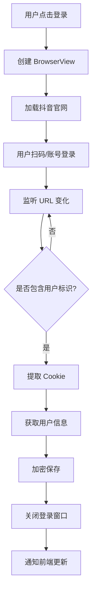

# 抖音登录 & Cookie 持久化功能说明

## ✨ 功能概述

实现了完整的抖音账号登录和 Cookie 持久化管理系统，确保用户关闭软件后 Cookie 信息不会丢失，下次启动时自动恢复登录状态。

---

## 🎯 核心特性

### 1. **安全的 Cookie 存储**
- ✅ AES-256-CBC 加密算法
- ✅ 存储在本地 userData 目录
- ✅ 仅保存关键 Cookie（如 `sessionid`, `ttwid` 等）
- ✅ 自动清理过期 Cookie

### 2. **内嵌登录浏览器**
- ✅ 使用 Electron BrowserView
- ✅ 加载抖音官网登录页
- ✅ 支持扫码登录和账号密码登录
- ✅ 自动检测登录成功
- ✅ 自动提取用户信息

### 3. **Cookie 管理**
- ✅ 登录成功后自动保存
- ✅ 应用启动时自动恢复
- ✅ 实时验证 Cookie 有效性
- ✅ 失效后提示重新登录
- ✅ 支持手动退出登录

### 4. **用户友好的 UI**
- ✅ 账号信息展示（昵称、UID、头像）
- ✅ Cookie 状态监控
- ✅ 登录时间记录
- ✅ 一键登录/退出

---

## 📂 技术实现

### 文件结构

```
electron/
├── douyin/
│   ├── cookie-manager.ts    # Cookie 管理核心
│   └── login-window.ts       # 登录窗口管理
├── ipc/
│   └── handlers.ts           # IPC 通信接口
└── preload.ts                # API 暴露

src/
├── components/
│   └── DouyinAccount.vue     # 账号管理组件
├── types/
│   └── index.ts              # TypeScript 类型定义
└── views/
    └── Settings.vue          # 设置页面（集成）

docs/
└── 抖音登录Cookie持久化功能说明.md
```

---

## 🔐 Cookie 加密存储

### 加密算法

**算法**: AES-256-CBC  
**密钥长度**: 32 字节  
**IV 长度**: 16 字节  

### 存储位置

```
Windows: C:\Users\<用户名>\AppData\Roaming\<应用名>\douyin\cookies.enc
macOS:   ~/Library/Application Support/<应用名>/douyin/cookies.enc
Linux:   ~/.config/<应用名>/douyin/cookies.enc
```

### 加密过程

```typescript
// 1. 生成随机 IV
const iv = randomBytes(16)

// 2. 创建加密器
const cipher = createCipheriv('aes-256-cbc', key, iv)

// 3. 加密数据
const encrypted = cipher.update(data, 'utf8', 'hex') + cipher.final('hex')

// 4. 存储格式：IV:加密数据
const stored = iv.toString('hex') + ':' + encrypted
```

### 关键 Cookie 字段

```typescript
[
  'sessionid',           // 会话ID（最重要）
  'sessionid_ss',
  'sid_guard',
  'uid_tt',             // 用户ID
  'uid_tt_ss',
  'sid_tt',
  'sid_ucp_v1',
  'ssid_ucp_v1',
  'ttwid',              // 设备标识
  'odin_tt',
  '__ac_nonce',
  '__ac_signature',
  'passport_csrf_token',
  'passport_csrf_token_default',
]
```

---

## 🪟 登录窗口实现

### BrowserView 方式

相比传统的 `webview` 标签，`BrowserView` 有以下优势：

- ✅ 性能更好
- ✅ 更好的安全性
- ✅ 完整的 Chromium 功能
- ✅ 独立的 Session

### 登录流程



### 登录成功检测

```typescript
// 监听页面导航
browserView.webContents.on('did-navigate', async (_, url) => {
  // 判断是否已登录（排除登录页和注册页）
  const isLoggedIn = 
    url.includes('douyin.com') &&
    !url.includes('login') &&
    !url.includes('passport')
  
  if (isLoggedIn) {
    // 等待 Cookie 设置完成
    await new Promise(resolve => setTimeout(resolve, 1000))
    
    // 提取并保存 Cookie
    const cookies = await getCookies()
    await saveCookies(cookies)
  }
})
```

---

## 🔌 IPC 通信接口

### 主进程 (electron/ipc/handlers.ts)

```typescript
// 1. 打开登录窗口
ipcMain.handle('douyin:openLogin', async (event) => {
  return new Promise((resolve) => {
    douyinLoginWindow.open(mainWindow, (account) => {
      resolve({ success: true, account })
    })
  })
})

// 2. 获取账号信息
ipcMain.handle('douyin:getAccount', async () => {
  const account = await cookieManager.loadAccount()
  return { success: !!account, account }
})

// 3. 退出登录
ipcMain.handle('douyin:logout', async () => {
  await cookieManager.clearAccount()
  return { success: true }
})

// 4. 检查 Cookie 状态
ipcMain.handle('douyin:checkCookieStatus', async () => {
  const account = await cookieManager.loadAccount()
  const isValid = await cookieManager.validateCookies(account.cookies)
  return { valid: isValid }
})

// 5. 注入 Cookie
ipcMain.handle('douyin:injectCookies', async () => {
  const account = await cookieManager.loadAccount()
  await cookieManager.injectCookies(account.cookies)
  return { success: true }
})
```

### 渲染进程 (src/components/DouyinAccount.vue)

```typescript
// 登录
const result = await window.electronAPI.openDouyinLogin()

// 获取账号
const account = await window.electronAPI.getDouyinAccount()

// 退出
await window.electronAPI.logoutDouyin()

// 检查状态
const status = await window.electronAPI.checkDouyinCookieStatus()
```

---

## 📊 数据结构

### DouyinAccount (账号信息)

```typescript
interface DouyinAccount {
  nickname: string          // 昵称
  uid: string               // 用户 ID
  avatarUrl?: string        // 头像 URL
  cookies: DouyinCookie[]   // Cookie 列表
  loginTime: number         // 登录时间戳
  lastActiveTime: number    // 最后活跃时间
}
```

### DouyinCookie

```typescript
interface DouyinCookie {
  name: string                  // Cookie 名称
  value: string                 // Cookie 值
  domain: string                // 域名
  path: string                  // 路径
  secure: boolean               // 是否 HTTPS
  httpOnly: boolean             // 是否 HttpOnly
  expirationDate?: number       // 过期时间戳
  sameSite?: 'lax' | 'strict'   // SameSite 属性
}
```

---

## 🎨 UI 组件

### DouyinAccount.vue

**位置**: `src/components/DouyinAccount.vue`

**功能**:
- 显示账号信息（昵称、UID、头像、登录时间）
- Cookie 状态监控
- 登录/退出操作
- Cookie 有效性刷新

**UI 状态**:

#### 未登录状态
```
┌───────────────────────────────────┐
│   抖音账号管理                ⓘ    │
├───────────────────────────────────┤
│                                   │
│         👤 (空头像)                │
│     尚未登录抖音账号               │
│                                   │
│   ┌─────────────────────┐        │
│   │  🌐 登录抖音账号    │        │
│   └─────────────────────┘        │
│                                   │
│  ℹ️ 点击登录后，将打开抖音官网， │
│     请使用扫码或账号密码登录      │
└───────────────────────────────────┘
```

#### 已登录状态（Cookie 有效）
```
┌───────────────────────────────────┐
│   抖音账号管理                ⓘ    │
├───────────────────────────────────┤
│                                   │
│  👤  测试用户                      │
│      UID: 1234567890              │
│      登录时间: 2025-11-26 10:30   │
│                                   │
│  ─────────────────────────────    │
│                                   │
│  Cookie 状态: ✅ 有效  🔄 刷新    │
│                                   │
│  ─────────────────────────────    │
│                                   │
│   [ 退出登录 ]                     │
└───────────────────────────────────┘
```

#### 已登录状态（Cookie 失效）
```
┌───────────────────────────────────┐
│   抖音账号管理                ⓘ    │
├───────────────────────────────────┤
│                                   │
│  👤  测试用户                      │
│      UID: 1234567890              │
│      登录时间: 2025-11-26 10:30   │
│                                   │
│  ─────────────────────────────────│
│                                   │
│  Cookie 状态: ❌ 失效  🔄 刷新    │
│                                   │
│  ⚠️ Cookie 已失效，请重新登录     │
│                                   │
│  ─────────────────────────────────│
│                                   │
│   [ 退出登录 ]  [ 重新登录 ]      │
└───────────────────────────────────┘
```

---

## 🚀 使用流程

### 1. 首次登录

```
用户 → 设置页面 → 抖音账号 Tab → 点击"登录抖音账号"
                                      ↓
                            打开 BrowserView 窗口
                                      ↓
                            用户扫码/账号登录
                                      ↓
                            自动检测登录成功
                                      ↓
                            提取并加密保存 Cookie
                                      ↓
                            关闭登录窗口
                                      ↓
                            显示账号信息
```

### 2. 应用重启后

```
应用启动 → 自动加载 Cookie
            ↓
    验证 Cookie 有效性
            ↓
    ┌──────┴──────┐
    │             │
  有效          失效
    │             │
自动注入      提示重新登录
    │
  恢复登录状态
```

### 3. Cookie 验证

```
定期验证（可选） → 调用抖音 API
                      ↓
                检查响应状态
                      ↓
              ┌──────┴──────┐
              │             │
            成功          失败
              │             │
          标记有效      标记失效
              │             │
          继续使用      提示重新登录
```

---

## 🔒 安全性考虑

### 1. Cookie 加密
- ✅ 使用 AES-256-CBC 对称加密
- ✅ 每次加密生成新的随机 IV
- ✅ 密钥基于 scrypt 派生

### 2. 存储隔离
- ✅ Cookie 存储在用户独立目录
- ✅ 文件权限仅限当前用户访问
- ✅ 不通过网络传输原始 Cookie

### 3. Session 隔离
- ✅ 登录窗口使用独立 Session (`persist:douyin`)
- ✅ 与主应用 Session 分离
- ✅ 防止跨域攻击

### 4. 敏感数据处理
- ✅ 仅保存必要的 Cookie 字段
- ✅ 不保存敏感个人信息
- ✅ 退出登录时完全清除数据

### 5. 安全建议

⚠️ **生产环境必须做的改进**:

1. **更安全的加密密钥**
   ```typescript
   // ❌ 当前（开发环境）
   const SALT = 'douyin-barrage-print-salt'
   
   // ✅ 生产环境应该
   const SALT = process.env.ENCRYPTION_SALT || generateRandomSalt()
   ```

2. **机器绑定**
   ```typescript
   // 将 Cookie 与机器码绑定
   const machineId = await getMachineId()
   const key = scryptSync(SALT + machineId, 'salt', 32)
   ```

3. **过期时间控制**
   ```typescript
   // 定期强制重新登录（如 30 天）
   const MAX_LOGIN_AGE = 30 * 24 * 60 * 60 * 1000
   if (Date.now() - account.loginTime > MAX_LOGIN_AGE) {
     await logout()
   }
   ```

4. **Cookie 签名验证**
   ```typescript
   // 验证 Cookie 未被篡改
   const signature = createHmac('sha256', secret)
     .update(JSON.stringify(cookies))
     .digest('hex')
   ```

---

## 🧪 测试步骤

### 1. 测试登录功能

```bash
# 1. 启动应用
npm run electron:dev

# 2. 进入设置页面
点击侧边栏 "设置" → "抖音账号" Tab

# 3. 点击登录
应该看到新窗口打开，显示抖音官网

# 4. 扫码或账号登录
使用真实抖音账号登录

# 5. 验证登录成功
- 登录窗口自动关闭
- 显示账号信息（昵称、UID）
- Cookie 状态显示"有效"
```

### 2. 测试 Cookie 持久化

```bash
# 1. 登录成功后，关闭应用
Ctrl+C 或关闭窗口

# 2. 检查 Cookie 文件
# Windows: C:\Users\<用户名>\AppData\Roaming\<应用名>\douyin\cookies.enc
# 应该看到 cookies.enc 文件存在

# 3. 重新启动应用
npm run electron:dev

# 4. 进入设置页面
点击侧边栏 "设置" → "抖音账号" Tab

# 5. 验证自动登录
- 应该看到之前的账号信息
- Cookie 状态应该显示"有效"
```

### 3. 测试 Cookie 验证

```bash
# 1. 登录成功后
点击"刷新"按钮

# 2. 观察 Cookie 状态
- 应该显示"有效"（如果 Cookie 未过期）
- 或显示"失效"（如果 Cookie 已过期）

# 3. 如果失效
- 应该看到警告提示
- 应该显示"重新登录"按钮
```

### 4. 测试退出登录

```bash
# 1. 在已登录状态下
点击"退出登录"按钮

# 2. 确认对话框
点击"确定"

# 3. 验证退出成功
- 账号信息消失
- 显示"尚未登录抖音账号"
- Cookie 文件被删除
```

---

## 🐛 常见问题

### Q1: 登录后窗口不关闭？

**原因**: 可能未检测到登录成功的 URL 特征

**解决**:
1. 检查浏览器控制台日志
2. 确认 URL 不包含 `login` 或 `passport`
3. 增加等待时间（1-2秒）

### Q2: Cookie 保存失败？

**原因**: 可能是目录权限问题或加密失败

**解决**:
1. 检查 userData 目录权限
2. 查看主进程日志中的错误信息
3. 确认 Node.js crypto 模块可用

### Q3: 应用重启后未自动登录？

**原因**: Cookie 文件可能不存在或解密失败

**解决**:
1. 检查 `cookies.enc` 文件是否存在
2. 查看日志中的解密错误
3. 尝试重新登录

### Q4: Cookie 状态显示失效？

**原因**: Cookie 确实已过期或抖音更新了验证机制

**解决**:
1. 点击"重新登录"
2. 如果频繁失效，可能需要更新验证逻辑

### Q5: 开发环境无法使用？

**原因**: 需要在 Electron 环境中运行

**说明**:
- ✅ 开发环境: `npm run electron:dev`
- ❌ 浏览器环境: `npm run dev` (纯前端开发服务器)

---

## 📈 未来优化

### 1. 多账号支持
```typescript
// 支持保存多个抖音账号
interface AccountList {
  accounts: DouyinAccount[]
  currentAccountId: string
}
```

### 2. Cookie 自动续期
```typescript
// 检测到即将过期时自动刷新
if (isExpiringSoon(cookie)) {
  await refreshCookie(cookie)
}
```

### 3. 云端同步（可选）
```typescript
// 支持将加密的 Cookie 同步到服务器
await syncToCloud(encryptedCookies)
```

### 4. 风险检测
```typescript
// 检测异常登录行为
if (isAbnormalLogin()) {
  await notifyUser()
  await requestReLogin()
}
```

### 5. Session 保持
```typescript
// 定期向抖音发送心跳请求
setInterval(async () => {
  await keepSessionAlive()
}, 5 * 60 * 1000) // 每 5 分钟
```

---

## 📝 开发注意事项

### 1. Cookie 字段更新

抖音可能会更新 Cookie 字段名称，需要定期检查：

```typescript
// electron/douyin/cookie-manager.ts
const DOUYIN_COOKIES = [
  // 定期检查并更新这个列表
  'sessionid',
  // ...
]
```

### 2. 登录成功检测

URL 特征可能变化，需要保持更新：

```typescript
// electron/douyin/login-window.ts
const isLoggedIn = 
  url.includes('douyin.com') &&
  !url.includes('login') &&
  !url.includes('passport')
  // 可能需要添加更多条件
```

### 3. 用户信息提取

页面结构可能变化，提供了多种备用方案：

```typescript
// 方法1: 全局变量
window.__INITIAL_STATE__?.user

// 方法2: localStorage
localStorage.getItem('userInfo')

// 方法3: DOM 元素
document.querySelector('.nickname')

// 方法4: Cookie 推断
extractFromCookie('uid_tt')
```

---

## 🎉 总结

### ✅ 已实现的功能

1. ✅ 安全的 Cookie 加密存储（AES-256）
2. ✅ 内嵌浏览器登录（BrowserView）
3. ✅ 自动检测登录成功
4. ✅ 用户信息提取（多种备用方案）
5. ✅ Cookie 持久化（应用重启后自动恢复）
6. ✅ Cookie 有效性验证
7. ✅ 过期 Cookie 清理
8. ✅ 退出登录清除数据
9. ✅ 友好的 UI 界面
10. ✅ 完整的 TypeScript 类型支持

### 🎯 关键优势

- **安全**: AES-256 加密，数据本地存储
- **可靠**: 多种备用方案，容错性强
- **易用**: 一键登录，自动持久化
- **灵活**: 支持退出、重新登录、状态刷新

### 🚀 后续集成

现在可以基于此模块继续开发：

1. **直播监控**: 使用保存的 Cookie 监听直播间
2. **弹幕抓取**: 通过 WebSocket 获取实时弹幕
3. **用户信息**: 获取当前登录用户的详细信息
4. **权限验证**: 确保操作在登录状态下进行

---

**© 2025 - 抖音弹幕打印系统 | Cookie 持久化模块 🍪**

